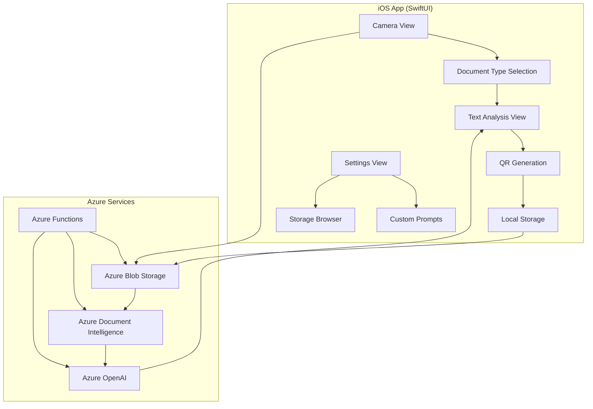

# デザイン文書

## 概要

KoEReq OCR (Azure Edition)は、カメラファーストのUXを採用したiOS/SwiftUIアプリケーションです。医療文書の撮影から解析、テキスト編集、QR生成、保存まで一連の流れを最小限の操作で実現します。Azure Document IntelligenceとAzure OpenAIを活用し、文書タイプ別の専用プロンプトによる高精度なテキスト化を提供します。

## アーキテクチャ

### システム全体構成



### データフロー

1. **撮影フェーズ**: カメラ → 画像蓄積 → Azure Blob Storage
2. **解析フェーズ**: Azure DI → OCRテキスト → 文書タイプ選択 → LLMプロンプト → Azure OpenAI → 構造化テキスト
3. **編集・保存フェーズ**: テキスト編集 → QR生成 → ローカル・クラウド保存

## コンポーネントとインターフェース

### 1. UI Components

#### CameraView
- **責任**: 撮影機能、画像蓄積、設定アクセス
- **主要機能**:
  - リアルタイムカメラプレビュー
  - 撮影ガイド枠表示
  - 撮影枚数カウンター
  - 「AIでテキスト化」ボタン
  - 設定ボタン（⚙️）

#### CircularDocumentTypeSelector
- **責任**: 文書タイプの円形メニュー表示・選択
- **主要機能**:
  - 円形レイアウトでボタン配置
  - プリセット文書タイプ（紹介状、お薬手帳、一般テキスト）
  - オリジナル文書タイプ
  - スクロール対応

#### TextAnalysisView
- **責任**: 解析結果表示・編集、QR生成
- **主要機能**:
  - 編集可能テキストフィールド
  - 「取り直し」ボタン
  - 「QR生成」ボタン
  - 複数画像結果の区別表示

#### SettingsView
- **責任**: 設定メニューのハブ
- **主要機能**:
  - オリジナル文書編集へのナビゲーション
  - ストレージ確認へのナビゲーション

#### CustomPromptEditor
- **責任**: オリジナル文書タイプの作成・編集
- **主要機能**:
  - 文書名入力フィールド
  - プロンプト入力フィールド（複数行）
  - 保存・削除機能
  - 一覧表示

#### StorageBrowser
- **責任**: 保存済みセッションの閲覧・検索
- **主要機能**:
  - セッション一覧表示
  - 検索・フィルタリング
  - セッション詳細表示

### 2. Service Layer

#### CameraService
```swift
protocol CameraService {
    func startCamera()
    func captureImage() -> UIImage?
    func getAccumulatedImages() -> [UIImage]
    func clearAccumulatedImages()
}
```

#### AzureStorageService
```swift
protocol AzureStorageService {
    func uploadImages(_ images: [UIImage]) async throws -> [String] // URLs
    func getSASToken(containerName: String, fileName: String) async throws -> String
    func saveSession(_ session: SessionData) async throws
}
```

#### DocumentIntelligenceService
```swift
protocol DocumentIntelligenceService {
    func analyzeDocument(imageUrls: [String]) async throws -> OCRResult
}
```

#### OpenAIService
```swift
protocol OpenAIService {
    func processText(ocrText: String, documentType: DocumentType, customPrompt: String?) async throws -> StructuredText
}
```

#### LocalStorageService
```swift
protocol LocalStorageService {
    func saveSession(_ session: SessionData) throws
    func loadSessions() throws -> [SessionData]
    func deleteSession(id: String) throws
    func saveCustomPrompt(_ prompt: CustomPrompt) throws
    func loadCustomPrompts() throws -> [CustomPrompt]
}
```

### 3. Business Logic Layer

#### DocumentProcessor
- **責任**: 文書処理の全体フロー制御
- **主要機能**:
  - 画像アップロード調整
  - DI解析実行
  - LLMプロンプト選択・実行
  - 結果統合

#### PromptManager
- **責任**: プロンプト管理
- **主要機能**:
  - プリセットプロンプト提供
  - オリジナルプロンプト管理
  - 文書タイプ別プロンプト選択

#### SessionManager
- **責任**: セッション管理
- **主要機能**:
  - セッション作成・保存
  - ローカル・クラウド同期
  - セッション検索・フィルタリング

## データモデル

### Core Models

```swift
struct SessionData: Codable, Identifiable {
    let id: String
    let images: [Data] // 画像データ
    let originalText: String // OCR結果
    let editedText: String // ユーザー編集後
    let documentType: DocumentType
    let customPromptUsed: String?
    let createdAt: Date
    let qrCodeGenerated: Bool
}

enum DocumentType: String, CaseIterable, Codable {
    case referralLetter = "紹介状"
    case medicationNotebook = "お薬手帳"
    case generalText = "一般テキスト"
    case custom = "オリジナル"
}

struct CustomPrompt: Codable, Identifiable {
    let id: String
    let name: String
    let prompt: String
    let createdAt: Date
}

struct OCRResult: Codable {
    let textBlocks: [String]
    let tables: [[[String]]]
    let checkboxes: [CheckboxInfo]
}

struct CheckboxInfo: Codable {
    let label: String
    let state: String // "selected" | "unselected"
    let bbox: [Double] // [x, y, w, h]
}

struct StructuredText: Codable {
    let mainText: String
    let tableData: String?
    let checkboxCount: Int?
    let summary: String?
}
```

### Configuration Models

```swift
struct AppConfiguration {
    static let azureEndpoint = Bundle.main.object(forInfoDictionaryKey: "AZURE_ENDPOINT") as! String
    static let functionsBaseURL = Bundle.main.object(forInfoDictionaryKey: "FUNCTIONS_BASE_URL") as! String
    static let storageBaseURL = Bundle.main.object(forInfoDictionaryKey: "STORAGE_BASE_URL") as! String
    
    // Container names
    static let rawContainer = "raw"
    static let diContainer = "di"
    static let sessionsContainer = "sessions"
}

struct PromptTemplates {
    static let referralLetter = """
    以下は紹介状のOCRテキストです。患者情報、診断内容、紹介理由を整理して読みやすい形式で出力してください：
    
    {OCR_TEXT}
    """
    
    static let medicationNotebook = """
    以下はお薬手帳のOCRテキストです。薬剤名、用法用量、処方日を整理して出力してください：
    
    {OCR_TEXT}
    """
    
    static let generalText = """
    以下のテキストを読みやすく整理して出力してください：
    
    {OCR_TEXT}
    """
}
```

## エラーハンドリング

### エラー分類

```swift
enum AppError: Error, LocalizedError {
    case cameraPermissionDenied
    case networkError(underlying: Error)
    case azureServiceError(message: String)
    case storageError(underlying: Error)
    case processingError(message: String)
    case subscriptionLimitExceeded
    
    var errorDescription: String? {
        switch self {
        case .cameraPermissionDenied:
            return "カメラへのアクセス許可が必要です"
        case .networkError:
            return "ネットワーク接続を確認してください"
        case .azureServiceError(let message):
            return "サービスエラー: \(message)"
        case .storageError:
            return "データの保存に失敗しました"
        case .processingError(let message):
            return "処理エラー: \(message)"
        case .subscriptionLimitExceeded:
            return "月次制限に達しました。プランをアップグレードしてください"
        }
    }
}
```

### 再送機能

```swift
class RetryManager {
    private let maxRetries = 3
    private let baseDelay: TimeInterval = 1.0
    
    func executeWithRetry<T>(_ operation: @escaping () async throws -> T) async throws -> T {
        var lastError: Error?
        
        for attempt in 0..<maxRetries {
            do {
                return try await operation()
            } catch {
                lastError = error
                if attempt < maxRetries - 1 {
                    let delay = baseDelay * pow(2.0, Double(attempt))
                    try await Task.sleep(nanoseconds: UInt64(delay * 1_000_000_000))
                }
            }
        }
        
        throw lastError!
    }
}
```

## テスト戦略

### Unit Tests
- **Service Layer**: 各サービスクラスの単体テスト
- **Business Logic**: DocumentProcessor、PromptManager、SessionManagerのテスト
- **Data Models**: Codable準拠、バリデーションロジックのテスト

### Integration Tests
- **Azure Services**: 実際のAzureサービスとの連携テスト
- **Storage**: ローカル・クラウドストレージの同期テスト
- **Camera**: カメラ機能とUI連携テスト

### UI Tests
- **Camera Flow**: 撮影からテキスト化までの完全フロー
- **Settings Flow**: オリジナルプロンプト作成・編集フロー
- **Storage Browser**: セッション検索・表示フロー

### Performance Tests
- **Image Processing**: 大量画像処理時のメモリ使用量
- **Network**: Azure API呼び出しのレスポンス時間
- **Storage**: ローカルストレージの読み書き性能

## セキュリティ考慮事項

### データ保護
- **画像データ**: Azure Blob StorageでPrivate Endpoint使用
- **認証**: Managed Identity使用でキー管理不要
- **暗号化**: 保存時・転送時の両方で暗号化

### プライバシー
- **匿名化ID**: ユーザー識別にUUIDを使用
- **データ最小化**: 必要最小限のデータのみ収集
- **透明性**: App Privacy Manifestで収集データを明示

### アクセス制御
- **カメラ**: 使用目的を明示した許可要求
- **ストレージ**: アプリサンドボックス内でのみアクセス
- **ネットワーク**: HTTPS通信のみ使用

## パフォーマンス最適化

### 画像処理
- **圧縮**: アップロード前にJPEG圧縮（品質80%）
- **リサイズ**: 長辺2000px制限で処理負荷軽減
- **バッチ処理**: 複数画像の並列アップロード

### メモリ管理
- **画像キャッシュ**: 撮影後の一時保存を最小限に
- **非同期処理**: UI応答性確保のためのバックグラウンド処理
- **リソース解放**: 不要になった画像データの即座解放

### ネットワーク最適化
- **接続プール**: URLSessionの再利用
- **タイムアウト**: 適切なタイムアウト設定
- **圧縮**: レスポンスデータのgzip圧縮

## 監査とログ

### 監査イベント
```swift
enum AuditEvent: String {
    case imageCaptured = "image_captured"
    case imageUploaded = "image_uploaded"
    case analysisStarted = "analysis_started"
    case analysisCompleted = "analysis_completed"
    case textEdited = "text_edited"
    case qrGenerated = "qr_generated"
    case sessionSaved = "session_saved"
    case error = "error"
}

struct AuditLog: Codable {
    let event: AuditEvent
    let sessionId: String?
    let userId: String
    let timestamp: Date
    let details: [String: String]
    let appVersion: String
    let deviceInfo: String
}
```

### ログ管理
- **ローカルログ**: 直近100件をローカル保存
- **クラウドログ**: 重要イベントをAzure Blob Storageに送信
- **エラーログ**: 詳細なスタックトレースと文脈情報
- **パフォーマンスログ**: 処理時間、メモリ使用量の記録